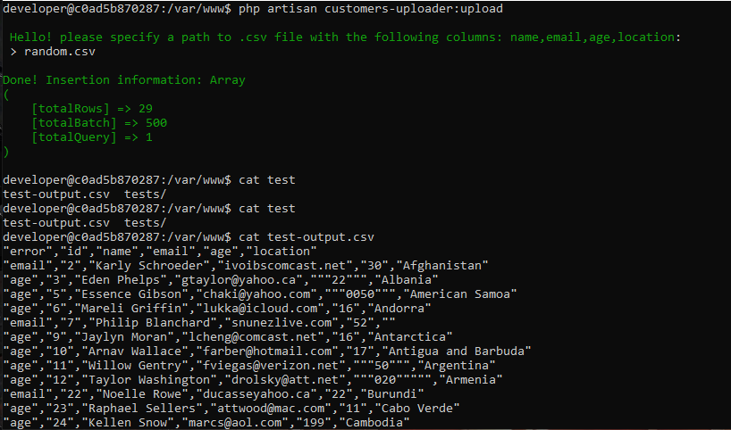
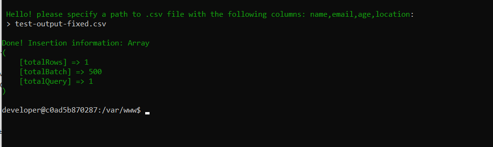
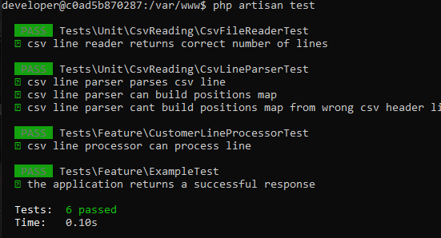
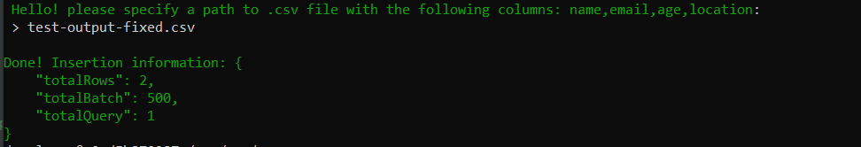

<p align="center"><a href="https://laravel.com" target="_blank"></a></p>

## Obalor test assignment (using laravel)

## Задача:
Используя Laravel/Lumen фреймворк, написать консольную команду которая перенесет данные из файла random.csv в базу данных в таблицу customers

## Условия:
1. Данные должны быть нормализованы и приведены к следующим типам и из них должны быть извлечены соответствующие данные:
◦ name – VARCHAR(255)
◦ surname – VARCHAR(255)
◦ email – VARCHAR(255)
◦ birth_year - DATE
◦ location – VARCHAR(255)
◦ country_code – VARCHAR(3) формат https://www.iban.com/country-codes
2. Перед записью в БД необходимо провести валидацию:
◦ Записи с невалидным email не должны быть созданы (проверки по RFC, DNS)
◦ Записи с невалидным age не должны быть созданы (допустимые значения 18 - 99)
◦ Записи с невалидным location должны быть созданы, однако невалидные значения должны быть заменены на Unknown
3. Консольная команда должна после исполнения должна выводить отчет в Excel, содержащий в себе все не созданные записи и причину их невалидности. Например, если email был не валиден, необходимо вывести исходную строку из файла полностью и добавить в поле error название (не значение) невалидной колонки (email)
4. Перед каждым запуском консольная команда не должна очищать таблицу customers и должна добавлять только новых клиентов, не затирая данные по старым

## Результат:
Ссылка на гит репозиторий, содержащий в себе Readme файл с описанием шагов для выполнения задачи.

## Пояснение

random.csv файл уже в репозитории для упрощения. Приложение
докерезировано запуск может быть осуществлен следующим образом.

1) Убедитесь что у вас установлен docker и docker-compose.
2) Склонируйте репозиорий `git clone https://github.com/Aleksej-Shherbak/obalor_test_assignment.git`
3) Перейдите в папку проекта `cd obalor_test_assignment` 
4) Запустите `docker-compose up -d`
5) Далее обеспечим управление контейнером при помощи bash. В консоли вводим `docker-compose exec php-fpm bash`
6) Уже находясь "в контейнере" запускаем установку пакетов и миграцию и сидинг базы `composer update && php artisan migrate && php artisan db:seed`
7) Запускаем саму команду, ради которой все и затевалось `php artisan customers-uploder:upload`
8) Команда предложет ввести путь к файлу. Вводим `random.csv`. Он в корне проека.
9) Команде потребуется некоторое время чтобы выполнить проверки (включая проверки DNS записи для емейлов). Список ошибочных строк можно получить так `cat test-output.csv`.



Все. Произойдет импорт данных и валидация. невалидные данные будут записаны в 
csv и выгружены в файл с именем `test-output.csv`. В текущей реализации я не 
предусматривал возможности задать путь для файла с ошибками. Однако такую 
возможность можно рассмотреть в рамках дальнейших доработок. 

Положение колонок в файле не важно. Главное чтоб были те колонки, которые запрашивает
команда в самом начале использования. Механизм построит карту позиций и выполнит парсинг
Это удобное если в файле есть лишние колонки, на которые мы не хотим обращать внмание. Выходной
файл с ошибками как раз является примером такого файла. Получив его, можно поправить то, на что 
жаловалась команда (поле error) и выполнить повторную загрузку.

На скрине файла ошибок видно, что у первого же пользователя (с id 2) неверный email.
Пробую его поправить вот так:


Как видим, у пользователя `Karly Schroeder` теперь
емейл `aleksej.shherbak@yandex.ru`. Запуская комманду на 
выполнение. Результат:



Как видим, команда сообщает, что одна строчка была добавлена. Остальные
по-прежнему не верны.

### Тесты

Проект частично покрыт тестами. Для запуска:

```bash
php artisan test 
```



P.S. `.env` фай коммитнут только в рамках демонстрационной задачи. Не делайте так никогда!

### Update 

Я решил сделать финальный вывод вот в таком виде:



Выглядит более дружелюбно для пользователя, чем дамп массива.
