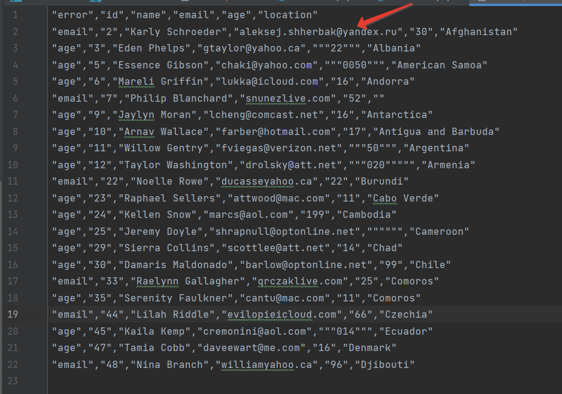

<p align="center"><a href="https://laravel.com" target="_blank"></a></p>

## Obalor test assignment (using laravel)

## Issue:
Using Laravel/Lumen framework, write a console program that will transfer data from the `random.csv` file into a database `customers` table. 

## Conditions:
1. You have allowed to use the following types in the `customers` table:
* name – VARCHAR(255)
* surname – VARCHAR(255)
* email – VARCHAR(255)
* birth_year - DATE
* location – VARCHAR(255)
* country_code – VARCHAR(3) format https://www.iban.com/country-codes
2. Before the inserting to the database you have to validate the following rules:
* Rows with invalid email shouldn't be recorded (check RFC and DNS)
* Rows with invalid age shouldn't be recorded  (allowed range is 18 - 99)
* Invalid location should be recorded as `Unknown` string
3. After running the command supposed to print a csv report that will contain failed rows and the reason of the fail. For example if email is invalid the command will print in the report the whole row and in the additional errors' column it will print the reason of the fail (string `email`) 
4. The command do not clear the `customers` table. It only adds new data. 

## Details

random.csv is committed in the repo already for simplicity. The application is dockerized and
could be started in the following way:

1) Make sure you have docker and docker-compose.
2) Clone the repo `git clone https://github.com/Aleksej-Shherbak/obalor_test_assignment.git`
3) Navigate to the project folder  `cd obalor_test_assignment` 
4) Run `docker-compose up -d`
5) Prepare to go inside the container using bash. Run in your terminal `docker-compose exec php-fpm bash`
6) Being in the container run packages installation and database migration `composer update && php artisan migrate && php artisan db:seed`
7) Run the command (the main subject of that assignment) `php artisan customers-uploader:upload`
8) It will suggest you to show the path to the `random.csv` file. Ender `./random.csv`. It's in the root of the project.
9) The command will require some time to check all validation rules (including DNS records for emails). Check what errors do we have we can with the help of the following command `cat test-output.csv`.


That's it. There will be data validation and import to the database. Invalid data will be recorded in  
csv with `test-output.csv` name. In this implementation I did not make an ability to specify the error file 
output path. But this might be implemented in the next version.  

Columns position in the input file does not matter. The program will calculate the position and create a
Position map object.
This is convenient if there are redundant columns in the file and we would like to ignore them. Output error file 
is a bright example of that file ("error" column is redundant and should be skipped). Once we have the error output file,
we can check what was the problem for each column fix them and use the file like import file.

On the following screenshot we can see that the user with id 2 has invalid email.
We can fix it:



Now, as we can see, user `Karly Schroeder` has `aleksej.shherbak@yandex.ru` email. Run the command again:


Command reports that one line was imported. The rest is still invalid.

### Tests

The project is partially covered with tests. To run the:

```bash
php artisan test 
```


P.S. `.env` is in the repo for demonstration purposes only. Do not do it in production!
